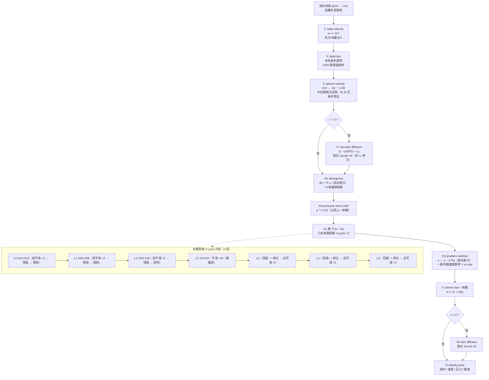

# Stable Fluids · WebGL2 算法流程图与实现说明

配套文件：`流体模拟.html`（单文件，双击即可运行；shader 全部内联为字符串，无任何外部库）

---

## 1. 求解的方程

不可压缩 Navier–Stokes（2D，密度归一）：

```
∂u/∂t = −(u·∇)u − ∇p + ν∇²u + f          （动量方程）
∇·u   = 0                                 （不可压缩约束）
∂d/∂t = −(u·∇)d + κ∇²d − α·d              （染料：被动标量 + 扩散 + 耗散）
```

Jos Stam 的 *Stable Fluids* 用**算子分裂**把一步 Δt 拆成四个可独立求解的子步，每一步都在 GPU 上对应一个或一组 shader pass。

---

## 2. 每帧 pass 流程（Mermaid）



## 3. 每帧 pass 流程（ASCII，与页面内「算法流程图」面板一致）

```
  鼠标线段 ─┬─► [1] splat velocity  w += Δt·f
            └─► [2] splat dye       多色高斯注入
                        │
                        ▼
   [3] advect velocity   u(x) ← u(x − u·Δt)     半拉格朗日
                        │
                        ▼   ν>0 才执行（否则跳过省带宽）
   [4] viscosity Jacobi ×N  (I − νΔt∇²)u = u₀
                        │
        ┌───────────────┴──── projection ────────────────┐
        │ [5] divergence      div = ∇·u  (后向差分)       │
        │ [6] pressure decay  p *= 0.82  (热启动)         │
        │ [7] 解 ∇²p = div：多重网格 V-cycle ×2            │
        │       L0 912×512  前平滑2 → 残差 → 限制↓        │
        │       L1 456×256  前平滑2 → 残差 → 限制↓        │
        │       L2 228×128  前平滑2 → 残差 → 限制↓        │
        │       L3 114×64   平滑10（最粗层）              │
        │       L2/L1/L0 逐层 回插↑+修正 → 后平滑2        │
        │ [8] gradient sub    u ← u − ∇p (前向差分)       │
        │                     + 最外圈速度置零(no-slip)   │
        └───────────────┬────────────────────────────────┘
                        ▼
   [9] advect dye  +  耗散 /(1+αΔt)  ─►  [10] dye diffusion（可选）
                        │
                        ▼
   [11] display pass  染料/速度/压力/散度

ping-pong：velocity / dye / pressure 各持两张 RGBA16F，
每个 pass 读 read 写 write 后 swap()，绝不同时读写同一纹理。
```

---

## 4. 数据布局

| 场 | 纹理 | 格式 | 分辨率（1920×1080 窗口下） | 通道含义 |
|---|---|---|---|---|
| 速度 u | ping-pong ×2 | RGBA16F | 912×512 | `.xy` = 速度（格/秒） |
| 染料 d | ping-pong ×2 | RGBA16F | 1820×1024 | `.rgb` = 浓度 |
| 压力 p | ping-pong ×2 | RGBA16F | 912×512 | `.x` |
| 散度 ∇·u | 单张 | RGBA16F | 912×512 | `.x`（= 多重网格 L0 右端项） |
| 扩散右端项 x₀ | 单张 ×2 | RGBA16F | 同对应场 | 隐式 Jacobi 的固定项 |
| 多重网格 L1–L3 | 每层 p×2 / rhs / res | RGBA16F | 456×256 → 114×64 | 修正量与残差 |

- 采样：`LINEAR` + `CLAMP_TO_EDGE`（ES 3.0 中 RGBA16F 可过滤；CLAMP 直接服务于边界条件）
- 渲染到 16F 需要 `EXT_color_buffer_float`，启动时检查并给出明确报错
- 每张新建纹理立即 `clear`，避免未初始化浮点垃圾变成 NaN 源头
- 短边对齐到 8 的倍数：多重网格的限制算子必须是精确 2×2 均值

---

## 5. 关键实现选择（以及为什么）

**① 散度用后向差分、梯度用前向差分**
两者复合恰好等于压力 Jacobi 使用的 5 点拉普拉斯 `p(i+1) − 2p(i) + p(i−1)`。若像很多 demo 那样两边都用中心差分，复合算子步长变成 2h，奇偶子格解耦，投影后散度压不下去——实测同一帧只能降 25%，改成前/后向配对后可降到 89%。这等价于 MAC 交错网格，只是数据仍存在同位纹理里。

**② 压力用多重网格而不是堆 Jacobi**
Jacobi 对波长 L 格的误差模每次迭代只衰减约 `1 − 2π²/L²`；笔刷半径约 22 格 ⇒ 主要误差模 L≈44 格 ⇒ 单次仅衰减 1%，20 次也只能压掉 ~25%（页面自检里可直接切「纯 Jacobi」复现）。粗网格上同一物理波长占的格数减半，Jacobi 衰减快 4 倍，所以 V-cycle 的等效代价（约 14 个全分辨率 pass）比 20 次 Jacobi 更低，残差却从 49% 降到 11%。

实测（456×256，同一帧散度 RMS 下降）：

| 求解器 | 散度 RMS 下降 | 等效全分辨率 pass |
|---|---|---|
| 纯 Jacobi ×20 | 50.9% | 20 |
| V-cycle ×1 | 83.2% | ~7 |
| V-cycle ×2 | 88.9% | ~14 |

**③ 无滑移边界的双重保障**
- 采样层：域外「虚拟格」取内侧速度的相反数（`u_ghost = −u_inner` ⇒ 壁面插值速度为 0），用 `step()` 乘法实现，无分支；压力则取内侧值（Neumann `∂p/∂n = 0`）。
- 输出层：`gradient subtract` 里把最外一圈速度乘 0。壁面不透水 ⇒ 染料与动量不可能泄漏出画面（自检实测边界速度恒为 0、边界染料恒为 0）。

**④ 数值护栏（不爆值）**
- Δt 夹紧在 [1/240, 1/30]，切后台回来不会一步炸掉
- 注入力度上限 3000 格/秒，advection 输出限幅同值
- **压力量纲缩放 S=8 + 限幅 ±3e4**：压力在「格」量纲下量级为 `p ~ div·R²`，极端输入下会突破 half-float 上限 65504 → Inf → 经 gradient 传播成整场 NaN（这是自检真实抓到的 bug）
- advection pass 对速度与被输运量都做 `isnan/isinf` 清洗（`mix` + `bvec`，无分支）：即使某帧出现坏值，也能在一帧内自愈

**⑤ 快速划动不留断点**
笔刷不是「在当前鼠标位置打一个点」，而是对「上一帧位置 → 当前位置」的**线段**求距离场（胶囊形高斯核），所以鼠标甩得再快，注入的轨迹也是连续的。

**⑥ 性能取舍**
- 邻域 UV（L/R/B/T）在**顶点着色器**里算好，用 varying 插值下发，省掉每像素的地址运算
- 全屏用一个大三角形（3 顶点）而不是 quad
- 粘度/扩散为 0 时**整段跳过**（默认即如此），省掉上百个 pass 的带宽
- 分支只出现在 display pass（uniform 分支，整个 draw call 走同一支，无 warp 内分歧）；模拟 pass 里的边界判断全部用 `step()/mix()` 算术实现
- 速度场跑 512 短边、染料场跑 1024 短边：涡旋结构由速度分辨率决定，视觉锐度由染料分辨率决定，这样比两者都开 1024 便宜 4 倍而观感接近

---

## 6. UI 控件与物理量的对应

| 控件 | 物理量 | 范围 | 说明 |
|---|---|---|---|
| 粘度 ν | 运动粘度 | 0–1 → ν = 0–1200 格²/秒 | α = νΔt；迭代次数随滑块 10→100 自动增加（α 大时 Jacobi 欠收敛，靠迭代数换有效扩散长度） |
| 扩散率 κ | 染料扩散系数 | 0–1 → κ = 0–260 格²/秒 | 0 = 关闭并跳过整段求解 |
| 耗散率 α | 染料淡出速率 | 0–4 /秒 | `d /= (1 + αΔt)` |
| 笔刷大小 | 高斯核半径 | 0.004–0.09（UV） | 按长宽比校正，保证是圆形 |
| 注入力度 | 冲量比例 | 1k–26k | 上限硬夹在 3000 格/秒 |
| 压力求解器 | — | V-cycle×2 / ×1 / 纯 Jacobi | 切换后可在「散度」视图里肉眼看出差别 |
| 模拟分辨率 | 网格短边 | 256/512/768/1024 | 长边按窗口长宽比放大，格子始终是正方形 |
| 显示 | — | 染料/速度/压力/散度 | 调 shader 时的调试视图 |

---

## 7. 自检

在网址后加 `?diag=1` 打开（例如 `流体模拟.html?diag=1`），左上角会输出 28 项自检结果，包括：

- WebGL2 / `EXT_color_buffer_float` / 15 个 shader 均为 GLSL ES 3.00 / 13 个 program 链接成功
- 纹理确为 16F（写入 1234.5 读回 1234.00，8bit 会被截到 ≤1）
- 三种压力求解器的散度残差对比
- 四壁速度恒为 0、边界染料恒为 0（无泄漏）
- 暴力乱划（跨屏瞬移 + 满力度 + 大 Δt）数百步后无 NaN、场有界
- 粘度对峰值流速与动能的影响（ν=max 时峰值降 70%、动能降 69%）
- 耗散率控件生效（染料总量降 68%）
- 快速划动轨迹连续性
- 全程 `gl.getError()` 无错误、控制台无 warning/error
- display pass 输出可见流体 + 画面 ASCII 缩略图

正常打开页面不会运行自检。
